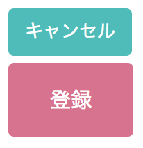
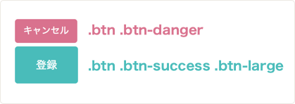
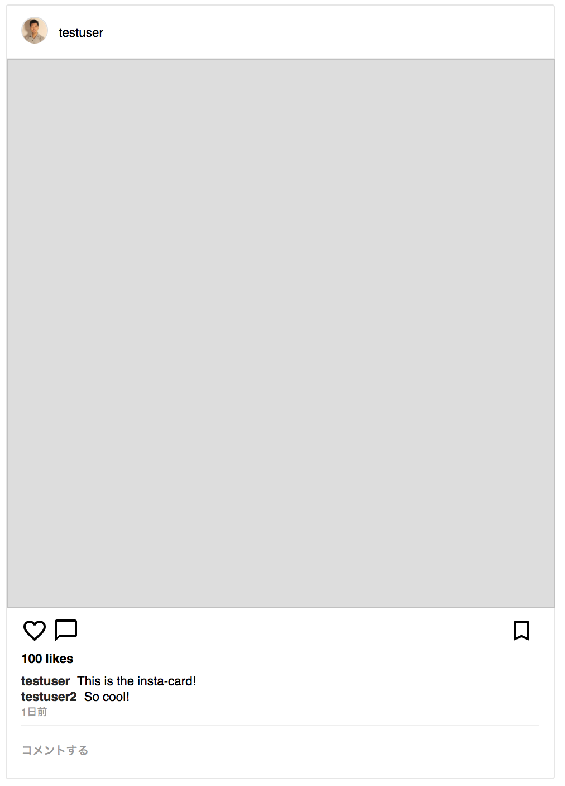
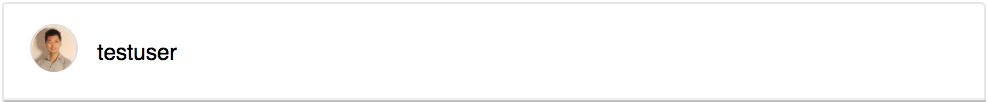
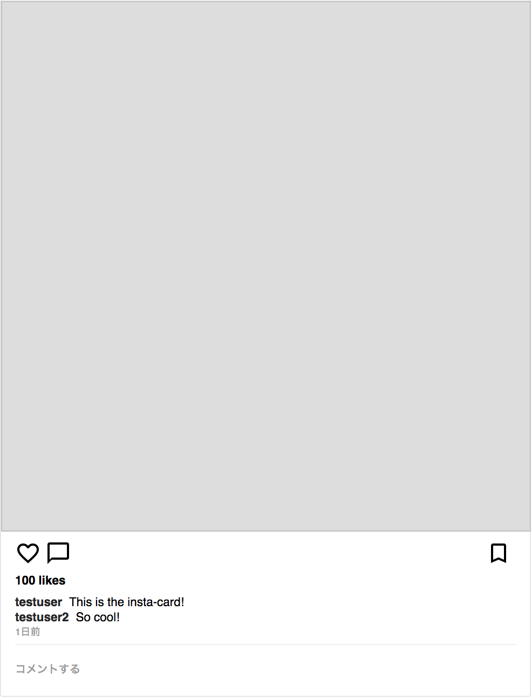
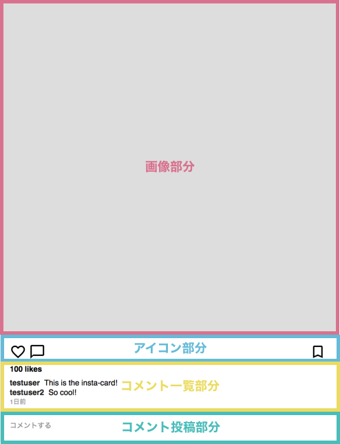
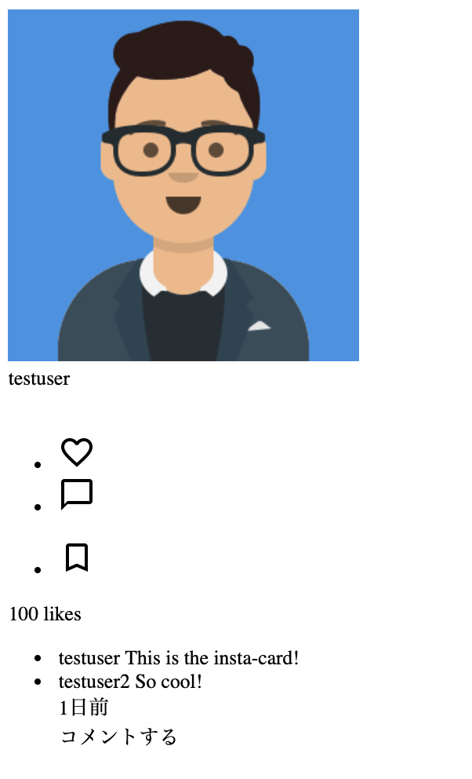

# CSSコンポーネントを作ろう

## CSSのデザイン方法論とは

ここまででCSSの基本について学んできましたが、このレッスンではCSS全体のデザイン方法について学んでいきます。

実際にフロントエンドエンジニアとしてチームでCSSのデザインをしていくと起こりがちなのが以下の問題です。

- 命名規則がないためにそのセレクタが何を意味するのか分からない
- 2つ以上のスタイルが混ざってしまって思ったようにデザイン出来ない
- 1つのセレクタのプロパティを変えると、思ってもないところのデザインが崩れてしまう

最初は小さく初めて簡単に編集が出来るように見えたCSSも規模が大きくなるにつれて、ごちゃごちゃとしたものとなり(スパゲッティコードと良くいいます)、ちょっとした変更にも時間がかかるようになってしまいます。

こうした問題を避けて、メンテナンスが容易に出来、スケーラビリティの高いCSSを書くための方法論を多くのフロントエンドエンジニアが模索してきました。現在主要なものには、オブジェクト指向CSS、BEM、SMACSSなどがあります。このレッスンでは、中でもBootstrapという有名なCSSフレームワークでも採用されているオブジェクト指向CSSについて学びます。

## オブジェクト指向CSS(OOCSS)とは

オブジェクト指向CSSは2008年に、米Yahoo!のエンジニアNicole Sullivan氏によって提唱されました。オブジェクト指向というのは、多くのプログラミング言語に採用されている概念です。オブジェクト指向CSSではその概念を、CSSデザインに適用することで、より再利用性が高く、管理しやすく、スケーラビリティの高いCSSコードを書くことが出来ます。

## OOCSSのオブジェクトとは？

OOCSSでのオブジェクトとは、Webサイトなどで繰り返し登場するヘッドライン、ヘッダー、ボタン、モダルような視覚的なパターンのことを指します。


## 実際の例を見てみる

詳しいOOCSSの説明に入る前に、OOCSSを適用しない悪いデザイン例と良いデザイン例を見ていきます。

1. 悪い書き方

```html
<div class="buttons">
  <div>
    <button class="button1">キャンセル</button>
  </div>
  <div>
    <button class="button2">登録</button>
  </div>
</div>
```
```css
.button1 {
  background-color: #4ABCBA;
  font-size: 13px;
  padding: 7px 12px;
  border: none;
  box-shadow: none;
  margin-bottom: 5px;
  color: #fff;
}
.button2 {
  background-color: #D9728E;
  font-size: 15px;
  padding: 15px 30px;
  border: none;
  box-shadow: none;
  margin-bottom: 5px;
  color: #fff;
}
```



ご覧の通り、悪い書き方ではそれぞれのボタンに対して全てのスタイルを記述しています。なぜこれが悪いかというとメンテナンスもしづらく、視認性も悪いからです。例えば、大きめの赤のボタンを作るときには更にもう一つクラスの定義をする必要があり、ボタンの数だけクラス定義が増えてしまいます。また、例えばですがフォントのサイズを13pxではなく12pxに変えたい場合、全てのボタンのフォントサイズを13pxから12pxに一個一個直さなければいけません。

2. 良い書き方

```html
<div class="buttons">
  <div>
    <button class="btn btn-danger">キャンセル</button>
  </div>
  <div>
    <button class="btn btn-success btn-large">登録</button>
  </div>
</div>
```
```css
.btn {
  font-size: 13px;
  padding: 7px 12px;
  border: none;
  box-shadow: none;
  margin-bottom: 5px;
  color: #fff;
}
.btn-danger {
  background-color: #D9728E;
}
.btn-success {
  background-color: #4ABCBA;
}
.btn-large {
  font-size: 15px;
  padding: 15px 30px;
}
```


[サンプルコード](https://github.com/codegrit-jp-students/codegrit-html-css-lesson05-sample-buttons-with-oocss)


このようにOOCSSではボタンという大きな概念に関する一般的なスタイルを最初に定義します。上記の例では`.btn`というクラスでボタンの一般的なクラスを定義し、`.btn-danger`、`.btn-success`ではボタンの色、`.btn-large`では大きなボタンの定義をしています。こうすることで例えば、大きめの赤ボタンを作りたい時はもう一つクラスを定義するのではなく`class="btn btn-danger btn-large"`と書けば、既にある定義を再利用して書くことが出来ます。

## OOCSSの2つの重要なルール

### 構造とスキンの分離(Separate structure and skin)

### 構造とは

抽象的なのですが、ここでいう構造は例えばボタンであればボタンという概念そのものを指します。ボタンそのもものイメージは以下のようなもので構成されます。

- 中心にあるコンテンツ(テキストや画像)
- コンテンツのパディング
- ボーダー
- ホバーすると色が変わる

スキンとは、このイメージに対しての視覚的な要素を指します。例えば以下のようなものです。

- ボタンの背景色やホバー時の色
- ボタンの幅や高さ
- 実際のパディングの大きさ
- ボタンの影

### コンテナーとコンテンツの分離(Separate container and content)

コンテナーとは入れ物のことで、コンテンツはこの入れ物の中に入るパーツのことを指します。例えばヘッダーには多くの場合、ロゴ、メニュー、登録ボタン、ログインボタンなどのコンテンツが入ります。

この時に`#main-header .btn { font-size: 15px; }`などのように、入れ物と中のコンテンツを組み合わせたスタイル定義ではなく、`btn-large`のようにより再利用性の高いクラスを利用するのがルールです。

例えばWebサイトでよく使われるのがカードです。(以下のインスタグラムのカードの例をご覧下さい。)このカードには多くの場合、ヘッダー部分と、ボディ部分、フッター部分があります。これをコンテナーとコンテンツとを分離せずに書いた例と分離した例が以下です。


1. 分離していない例

```css
.card {...}
.card .header {...}
.card .body {...}
.card .footer {...}
```

2. 分離している例

```css
.card {...}
.card-header {...}
.card-body {...}
.card-footer {...}
```

## OOCSSを使う上でのコツ

OOCSSを利用する主目的の一つが再利用性とメンテナンス性です。これらを高める上で以下のコツを意識しましょう。

- `id`属性をスタイリングで利用しない
id属性は一つのHTMLドキュメント内で一度しか使えず、再利用性が低いためOOCSSでは`id`属性をCSSデザインで使うことを非推奨としています。

- `!important`の利用は出来る限り避ける
`!important`も一般的なクラスの振る舞いを変えてしまい、予測が難しくなるため利用を出来る限り避けましょう。

- 誰が見ても分かりやすく、出来るだけ短い名前を付ける
あまりに長い名前だとHTML文書内で書くのが大変な上、タイプミスが出てしまいます。かと言って短縮形で分かりづらい名前を使うと、どう使えばいいのか他の人が分からず同じコンポーネントに他のクラスを追加で書いてしまう可能性があります。

- 一部分のみのスタイリングは出来るだけ避ける
一部分だけに適用されるようなセレクタの利用は出来るだけ避けましょう。こうすることでCSS全体のセレクタの数を最小限にして、メンテナンス性を高められます。


## コンポーネント

OOCSSの提唱者Nicole Sullivan氏はコンポーネントをLEGOのブロックと例えています。LEGOでは一つ一つのパーツの種類は限られていますが、それを組み合わせることで様々なことなるものを作れます。それと同様に、Webサイトでもボタンやタブなど最小単位のモノをデザインしておき、それを組み合わせることで色々なWebサイトを作れます。この最小単位のモノをコンポーネントと呼びます。

例えば100ページのWebページを作る場合でも、先にこのコンポーネントを定義しておき全てのページでこのコンポーネントの組み合わせを利用するようにすることをイメージしてください。そうすることでページごとに別のコンポーネントを作る必要がないので、書かないといけないコード量は大幅に減ります。また同じコンポーネントを利用することで、Webサイト全体のデザインを統一することが出来、ユーザーが混乱しません。

## 実際にコンポーネントを作ろう

Webサイトで良く使われるコンポーネントの一つがカードです。ここではインスタグラムの投稿風のカードをデザインしてみましょう。



### コンポーネントをパーツに分け、構造をHTMLで記述する

今回は、カードをヘッダー部分とボディ部分との2つに分けました。構成の決め方は特に決まりがないので、自分で決めて大丈夫です。

- ヘッダー部分



- ボディ部分



ボディ部分は更に、画像部分とそれ以外の部分に別れており、それ以外の部分も以下の画像のように複数のパーツに別れます。



このようにコンポーネントを作成する時は、作りたいコンポーネントを更に細かいパーツに分けて考えます。いきなりカードを作ろうとすると難しいですが、このようにパーツに分けてから、パーツを1個1個HTMLとCSSに落とし込むことで何をすればいいかが明確になります。

まずはこうした、複数のパーツでコンポーネントの構成をHTMLで表現します。

```html
<!DOCTYPE html>
<html>
<head>
</head>
<body>
  <article class="card">
    <section class="card-header">
      <div class="card-poster-avatar">
        
      </div>
      <div class="card-poster-name">
        testuser
      </div>
    </section>
    <section class="card-body">
      <div class="card-image">
        
      </div>
      <section class="card-main">
        <div class="card-main-icons">
          <ul class="flex-container card-main-icons-left">
            <li class="icon-heart">
              
            </li>
            <li class="icon-comment">
              
            </li>
          </ul>
          <ul class="flex-container card-main-icons-right">
            <li class="icon-bookmark icons-right">
              
            </li>
          </ul>
        </div>
        <div class="card-like-counts">100 likes</div>
        <ul class="card-comments">
          <li class="card-poster-comment">
            <a class="card-commenter-name">
              testuser
            </a>
            <span class="card-commenter-comment">
              This is the insta-card!
            </span>
          </li>
          <li>
            <a class="card-commenter-name">
              testuser2
            </a>
            <span class="card-commenter-comment">
              So cool!
            </span>
          </li>
        </div>
        <div class="card-post-date">1日前</div>
        <section class="card-comment-box">
          <div class="card-comment-area">コメントする</div>
        </section>
      </section>
    </section>
  </article>
</body>
</html>
```



### 分けたパーツそれぞれにCSSを入れていく

コンポーネントをパーツに分けたら、それぞれのパーツにCSSを適用していきます。

```css
/* ベース部分 */
* {
  box-sizing: border-box;
}
body {
  font-size: 14px;
  line-height: 18px;
  font-family: Helvetica, Arial, sans-serif;
}
a {
  text-decoration: none;
  color: #262626;
  font-weight: 600;
}
ul {
  list-style: none;
}
ul,
li {
  margin: 0;
  padding: 0;
  border: 0;
  font: inherit;
  vertical-align: baseline;
}

/* flexを簡単に使うためのクラス */

.flex-container {
  display: flex;
}

/* insta-card */
.insta-card {
  display: flex;
  flex-direction: column;
  max-width: 614px;
  width: 100%;
  border: 1px solid #e6e6e6;
  border-radius: 3px;
}

/* ヘッダー部分 */
.card-header {
  display: flex;
  align-items: center;
  border-bottom: 1px solid #efefef;
  padding: 16px;
  height: 60px;
}
.poster-avatar {
  margin-right: 12px;
}
.poster-avatar img {
  border-radius: 50%;
  border: 1px solid #dddddd;
  height: 30px;
  width: 30px;
}

/* ボディ部分 */

/* 画像部分 */
.card-image {
  width: 100%;
  margin: 0;
  padding: 0;
}
.card-image img {
  height: 613px;
  width: 613px;
  border: 0;
  background-color: #dddddd;
}

/* 画像以外の部分 */
.card-main {
  padding: 0 16px;
}
.card-main-icons {
  margin-top: 4px;
  height: 40px;
  display: flex;
  justify-content: space-between;
  align-items: center;
}

/* アイコン部分 */
.icons {
  display: flex;
  justify-content: space-between;
}
.card-main-icons ul>li {
  margin-right: 5px;
}
.like-counts {
  font-weight: bold;
  margin-bottom: 8px;
}

/* コメント一覧部分 */
.comments {
  margin-bottom: 4px;
}
.comments a {
  margin-right: .3em;
}

.post-date {
  margin-bottom: 4px;
  font-size: 10px;
  letter-spacing: .2px;
  color: #999;
  margin-bottom: 5px;
  text-transform: uppercase;
}

/* コメント投稿部分 */
.comment-box {
  border-top: 1px solid #efefef;
  color: #999;
  min-height: 56px;
  display: flex;
  align-items: center;
  font-size: 0.9em;
}
```

いかがでしょう。長くなっているので、難しそうに感じるかもしれませんが、実際にはヘッダーの部分からパーツごとに順番に定義していっているので一つ一つのパーツの部分で見ればそれほど難しくないはずです。またレッスン4で習ったFlexboxを多く利用していますので、是非どんな風に使っているのか詳しく見てみて下さい。

[サンプルコード](https://github.com/codegrit-jp-students/codegrit-html-css-lesson05-sample-insta-card)

## チャレンジ

[チャレンジ5](./challenge/README.md)

## 更に学ぼう

### 記事で学ぶ

- [An Introduction To Object Oriented CSS (OOCSS)](https://www.smashingmagazine.com/2011/12/an-introduction-to-object-oriented-css-oocss/)
