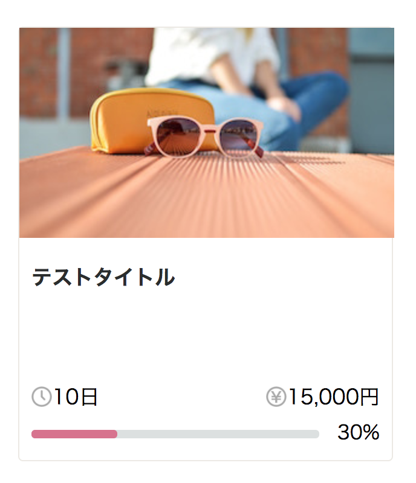

# チャレンジ5

```
所要時間: 30分
ステータス: 公開
タイプ: 課題
```

## 目的

- CSSコンポーネントを1人で設計出来るようになる
- 設計したコンポーネントを実装出来るようになる

## チャレンジの取り組み方

1. マイルストーンごとに要件に合うようにファイルを編集していきます。
2. 分からない部分があれば、テキストを復習して、再度チャレンジしてみましょう。
3. 再チャレンジしてしばらく考えても分からない場合はチャットでメンターに質問しましょう。
4. 完成したら、Dropboxでメンターとファイルを共有して下さい。
5. メンターから課題レビューが届きます。
6. ビデオチャットの際は、分からない点を更に突っ込んで聞いたり、より良い書き方を聞いてみましょう。

## 概要

クラウドファンディングをご存知でしょうか？クラウドファンディングでは、何かのプロジェクトに対して、そのプロジェクトを応援したい人がその商品であったり、何らかのリターンを購入することでプロジェクトを応援することが出来ます。今回はMakuakeというサービスのプロジェクト表示コンポーネントに近いカードをデザインしてみましょう。



## スターターファイル

以下のURLのコードをテンプレートとして利用して下さい。

- [codegrit-html-css-ch05-starter](https://github.com/codegrit-jp-students/codegrit-html-css-ch05-starter)

## マイルストーン

### 要件(スペック)

- カードは上限に分かれており、上部ではプロジェクトの写真、下部ではプロジェクトの名前、残り日数、集まった金額、達成率が表示されます。
- タイトルは最大で3行まで表示されます。タイトルの長さに関わらずタイトル表示部分は同じ高さで表示します。(カードの高さを360px、幅を310pxで固定します。)
- 画像はカードの幅一杯表示されるようにします。(paddingなし)
- バーは達成率に応じて緑の部分の長さが変わります。50%の場合は半分の長さとなり、100%以上の場合はバー全て緑色となります。今回は達成率が30%のときの例を試しに作ってみましょう。

### ヒント

- まずはCSSを使わずにHTMLだけでカードの構造を形にしてみましょう。
- バーの表示を割合ごとに変えるには2つのバーを同じ位置で重ねて、上に重ねているバーの色の幅を割合ごとに変えます。`position:relative;`と`position:absolute`を上手く使って2つのバーを重ねましょう。
- キャッチ画像と時計マークと円マークのアイコンは以下にあります。

  - [キャッチ画像](./shared/sunglasses.jpg)
  - [時計マーク](./shared/clock.png)
  - [円マーク](./shared/yen.png)


## 評価

課題の後、以下の２つについてメンターにフィードバックをお願いします。

1. 要件のカバー度: 1.全く出来なかった 2.ほとんど出来なかった 3. 半分ほどは出来た 4.8割ほどは出来た 5. 全部出来た
2. 難易度: 1. とても難しかった 2. 難しかった 3. ちょうど良かった 4. 簡単だった 5. とても簡単だった
