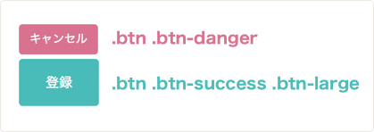

## CSSのデザイン方法論とは

ここまででCSSの基本について学んできましたが、このレッスンではCSS全体のデザイン方法について学んでいきます。

実際にフロントエンドエンジニアとしてチームでCSSのデザインをしていくと起こりがちなのが以下の問題です。

- 命名規則がないためにそのセレクタが何を意味するのか分からない
- 2つ以上のスタイルが混ざってしまって思ったようにデザイン出来ない
- 1つのセレクタのプロパティを変えると、思ってもないところのデザインが崩れてしまう

最初は小さく初めて簡単に編集が出来るように見えたCSSも規模が大きくなるにつれて、ごちゃごちゃとしたものとなり(スパゲッティコードと良くいいます)、ちょっとした変更にも時間がかかるようになってしまいます。

こうした問題を避けて、メンテナンスが容易に出来、スケーラビリティの高いCSSを書くための方法論を多くのフロントエンドエンジニアが模索してきました。現在主要なものには、オブジェクト指向CSS、BEM、SMACSSなどがあります。このレッスンでは、中でもBootstrapという有名なCSSフレームワークでも採用されているオブジェクト指向CSSについて学びます。

## オブジェクト指向CSS(OOCSS)とは

オブジェクト指向CSSは2008年に、米Yahoo!のエンジニアNicole Sullivan氏によって提唱されました。オブジェクト指向というのは、多くのプログラミング言語に採用されている概念です。オブジェクト指向CSSではその概念を、CSSデザインに適用することで、より再利用性が高く、管理しやすく、スケーラビリティの高いCSSコードを書くことが出来ます。

## OOCSSのオブジェクトとは？

OOCSSでのオブジェクトとは、Webサイトなどで繰り返し登場するヘッドライン、ヘッダー、ボタン、モダルような視覚的なパターンのことを指します。


## 実際の例を見てみる

詳しいOOCSSの説明に入る前に、OOCSSを適用しない悪いデザイン例と良いデザイン例を見ていきます。

1. 悪い書き方

```html
<div class="buttons">
  <div>
    <button class="button1">キャンセル</button>
  </div>
  <div>
    <button class="button2">登録</button>
  </div>
</div>
```
```css
.button1 {
  background-color: #4ABCBA;
  font-size: 13px;
  padding: 7px 12px;
  border: none;
  box-shadow: none;
  margin-bottom: 5px;
  color: #fff;
}
.button2 {
  background-color: #D9728E;
  font-size: 15px;
  padding: 15px 30px;
  border: none;
  box-shadow: none;
  margin-bottom: 5px;
  color: #fff;
}
```


ご覧の通り、悪い書き方ではそれぞれのボタンに対して全てのスタイルを記述しています。なぜこれが悪いかというとメンテナンスもしづらく、視認性も悪いからです。例えば、大きめの赤のボタンを作るときには更にもう一つクラスの定義をする必要があり、ボタンの数だけクラス定義が増えてしまいます。また、例えばですがフォントのサイズを13pxではなく12pxに変えたい場合、全てのボタンのフォントサイズを13pxから12pxに一個一個直さなければいけません。

2. 良い書き方

```html
<div class="buttons">
  <div>
    <button class="btn btn-danger">キャンセル</button>
  </div>
  <div>
    <button class="btn btn-success btn-large">登録</button>
  </div>
</div>
```
```css
.btn {
  font-size: 13px;
  padding: 7px 12px;
  border: none;
  box-shadow: none;
  margin-bottom: 5px;
  color: #fff;
}
.btn-danger {
  background-color: #D9728E;
}
.btn-success {
  background-color: #4ABCBA;
}
.btn-large {
  font-size: 15px;
  padding: 15px 30px;
}
```


[サンプルコード](https://github.com/codegrit-jp-students/codegrit-html-css-lesson05-sample-buttons-with-oocss)


このようにOOCSSではボタンという大きな概念に関する一般的なスタイルを最初に定義します。上記の例では`.btn`というクラスでボタンの一般的なクラスを定義し、`.btn-danger`、`.btn-success`ではボタンの色、`.btn-large`では大きなボタンの定義をしています。こうすることで例えば、大きめの赤ボタンを作りたい時はもう一つクラスを定義するのではなく`class="btn btn-danger btn-large"`と書けば、既にある定義を再利用して書くことが出来ます。