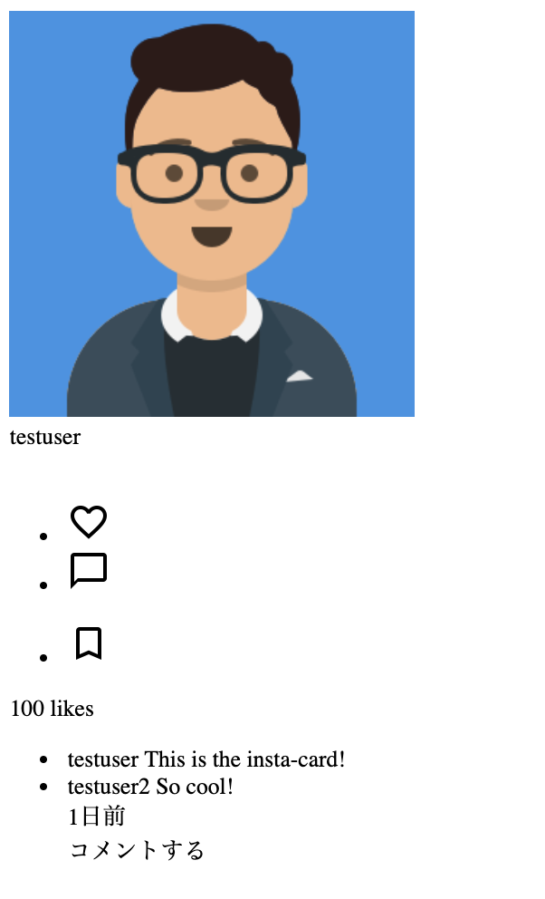

## コンポーネント

OOCSSの提唱者Nicole Sullivan氏はコンポーネントをLEGOのブロックと例えています。LEGOでは一つ一つのパーツの種類は限られていますが、それを組み合わせることで様々なことなるものを作れます。それと同様に、Webサイトでもボタンやタブなど最小単位のモノをデザインしておき、それを組み合わせることで色々なWebサイトを作れます。この最小単位のモノをコンポーネントと呼びます。

例えば100ページのWebページを作る場合でも、先にこのコンポーネントを定義しておき全てのページでこのコンポーネントの組み合わせを利用するようにすることをイメージしてください。そうすることでページごとに別のコンポーネントを作る必要がないので、書かないといけないコード量は大幅に減ります。また同じコンポーネントを利用することで、Webサイト全体のデザインを統一することが出来、ユーザーが混乱しません。

## 実際にコンポーネントを作ろう

Webサイトで良く使われるコンポーネントの一つがカードです。ここではインスタグラムの投稿風のカードをデザインしてみましょう。


### コンポーネントをパーツに分け、構造をHTMLで記述する

今回は、カードをヘッダー部分とボディ部分との2つに分けました。構成の決め方は特に決まりがないので、自分で決めて大丈夫です。

- ヘッダー部分


- ボディ部分


ボディ部分は更に、画像部分とそれ以外の部分に別れており、それ以外の部分も以下の画像のように複数のパーツに別れます。


このようにコンポーネントを作成する時は、作りたいコンポーネントを更に細かいパーツに分けて考えます。いきなりカードを作ろうとすると難しいですが、このようにパーツに分けてから、パーツを1個1個HTMLとCSSに落とし込むことで何をすればいいかが明確になります。

まずはこうした、複数のパーツでコンポーネントの構成をHTMLで表現します。

```html
<!DOCTYPE html>
<html>
<head>
</head>
<body>
  <article class="card">
    <section class="card-header">
      <div class="card-poster-avatar">
        
      </div>
      <div class="card-poster-name">
        testuser
      </div>
    </section>
    <section class="card-body">
      <div class="card-image">
        
      </div>
      <section class="card-main">
        <div class="card-main-icons">
          <ul class="flex-container card-main-icons-left">
            <li class="icon-heart">
              
            </li>
            <li class="icon-comment">
              
            </li>
          </ul>
          <ul class="flex-container card-main-icons-right">
            <li class="icon-bookmark icons-right">
              
            </li>
          </ul>
        </div>
        <div class="card-like-counts">100 likes</div>
        <ul class="card-comments">
          <li class="card-poster-comment">
            <a class="card-commenter-name">
              testuser
            </a>
            <span class="card-commenter-comment">
              This is the insta-card!
            </span>
          </li>
          <li>
            <a class="card-commenter-name">
              testuser2
            </a>
            <span class="card-commenter-comment">
              So cool!
            </span>
          </li>
        </div>
        <div class="card-post-date">1日前</div>
        <section class="card-comment-box">
          <div class="card-comment-area">コメントする</div>
        </section>
      </section>
    </section>
  </article>
</body>
</html>
```



### 分けたパーツそれぞれにCSSを入れていく

コンポーネントをパーツに分けたら、それぞれのパーツにCSSを適用していきます。

```css
/* ベース部分 */
* {
  box-sizing: border-box;
}
body {
  font-size: 14px;
  line-height: 18px;
  font-family: Helvetica, Arial, sans-serif;
}
a {
  text-decoration: none;
  color: #262626;
  font-weight: 600;
}
ul {
  list-style: none;
}
ul,
li {
  margin: 0;
  padding: 0;
  border: 0;
  font: inherit;
  vertical-align: baseline;
}

/* flexを簡単に使うためのクラス */

.flex-container {
  display: flex;
}

/* insta-card */
.insta-card {
  display: flex;
  flex-direction: column;
  max-width: 614px;
  width: 100%;
  border: 1px solid #e6e6e6;
  border-radius: 3px;
}

/* ヘッダー部分 */
.card-header {
  display: flex;
  align-items: center;
  border-bottom: 1px solid #efefef;
  padding: 16px;
  height: 60px;
}
.poster-avatar {
  margin-right: 12px;
}
.poster-avatar img {
  border-radius: 50%;
  border: 1px solid #dddddd;
  height: 30px;
  width: 30px;
}

/* ボディ部分 */

/* 画像部分 */
.card-image {
  width: 100%;
  margin: 0;
  padding: 0;
}
.card-image img {
  height: 613px;
  width: 613px;
  border: 0;
  background-color: #dddddd;
}

/* 画像以外の部分 */
.card-main {
  padding: 0 16px;
}
.card-main-icons {
  margin-top: 4px;
  height: 40px;
  display: flex;
  justify-content: space-between;
  align-items: center;
}

/* アイコン部分 */
.icons {
  display: flex;
  justify-content: space-between;
}
.card-main-icons ul>li {
  margin-right: 5px;
}
.like-counts {
  font-weight: bold;
  margin-bottom: 8px;
}

/* コメント一覧部分 */
.comments {
  margin-bottom: 4px;
}
.comments a {
  margin-right: .3em;
}

.post-date {
  margin-bottom: 4px;
  font-size: 10px;
  letter-spacing: .2px;
  color: #999;
  margin-bottom: 5px;
  text-transform: uppercase;
}

/* コメント投稿部分 */
.comment-box {
  border-top: 1px solid #efefef;
  color: #999;
  min-height: 56px;
  display: flex;
  align-items: center;
  font-size: 0.9em;
}
```

いかがでしょう。長くなっているので、難しそうに感じるかもしれませんが、実際にはヘッダーの部分からパーツごとに順番に定義していっているので一つ一つのパーツの部分で見ればそれほど難しくないはずです。またレッスン4で習ったFlexboxを多く利用していますので、是非どんな風に使っているのか詳しく見てみて下さい。

[サンプルコード](https://github.com/codegrit-jp-students/codegrit-html-css-lesson05-sample-insta-card)

## 更に学ぼう

### 記事で学ぶ

- [An Introduction To Object Oriented CSS (OOCSS)](https://www.smashingmagazine.com/2011/12/an-introduction-to-object-oriented-css-oocss/)
